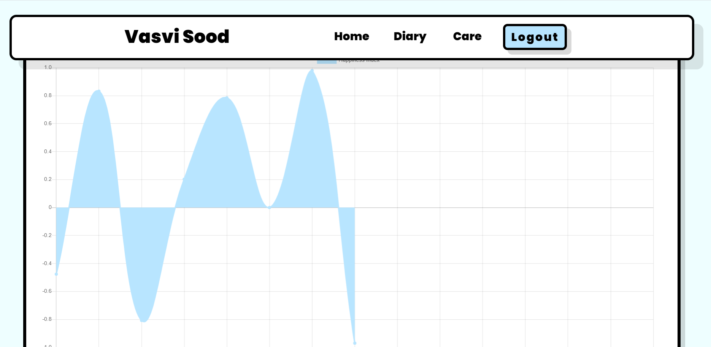

User Guide
============

This guide is for making users familiar with PriJour's functionality and features:

.. image:: https://github.com/vasvi-sood/PriJour-Documentation/blob/main/build/html/assets/login.png
   :alt: Login Screen
   

Use your Google account to register or log in. We want to provide you with a personalized experience, so  it’s important that you register.

.. image:: ./assets/journal.png
   :alt: Journal Screen

Spill out your emotions in the journal and save them with this button.

We save all of your journal entries.

A graph of the happiness index based on Journal entries. The graph gets closer to 1 as the mood improves. It gets closer it gets to -1, when the mood is gloomy.

   

  

The mood tracker quiz determines the user's mood and displays a custom feed based on the results.

Mamta has a variety of jokes, quotes, and movie recommendations, among other things. She lends her ears whenever you want to say something.
